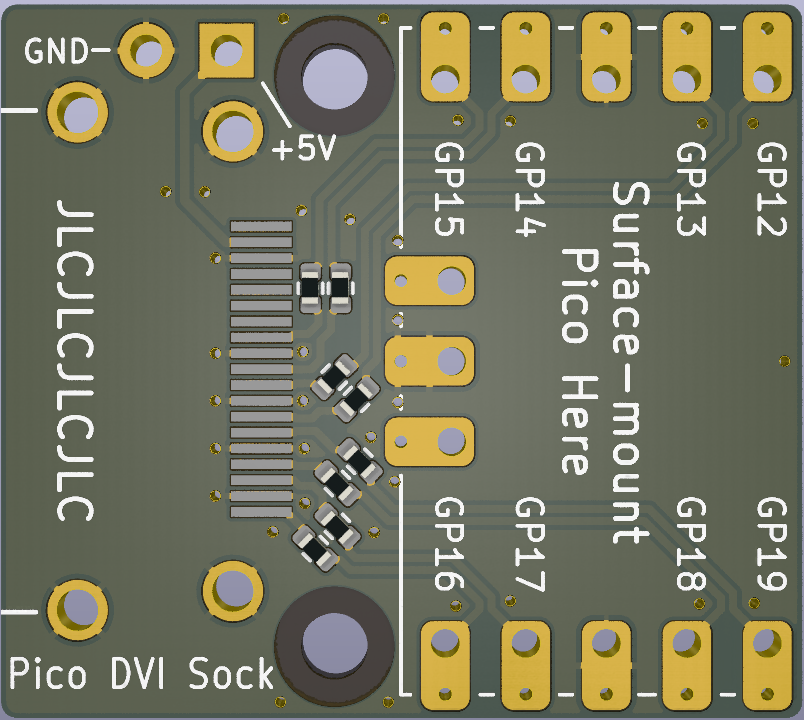

Pico DVI Sock
=============

You surface mount solder the Raspberry end of your Pico on top of this board (thanks to the castellations on Pico's header footprints). This gives you an HDMI-shaped socket at the opposite end to the micro USB socket, which you can drive DVI-D video through. The remaining Pico pins can still have headers inserted, so that the board can be inserted into a breadboard.

[See the schematic (PDF)](dvi-sock.pdf)
