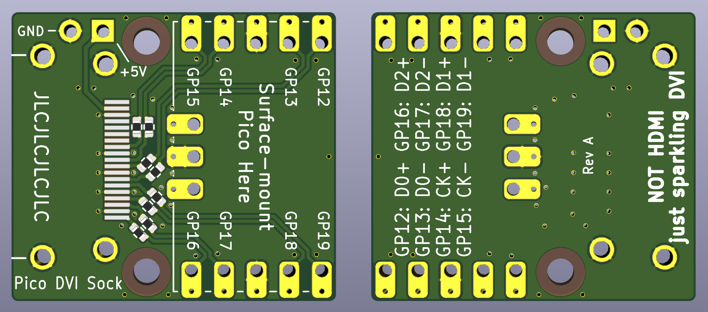
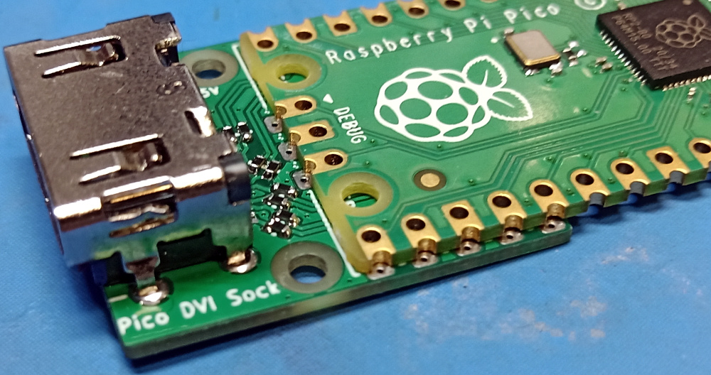
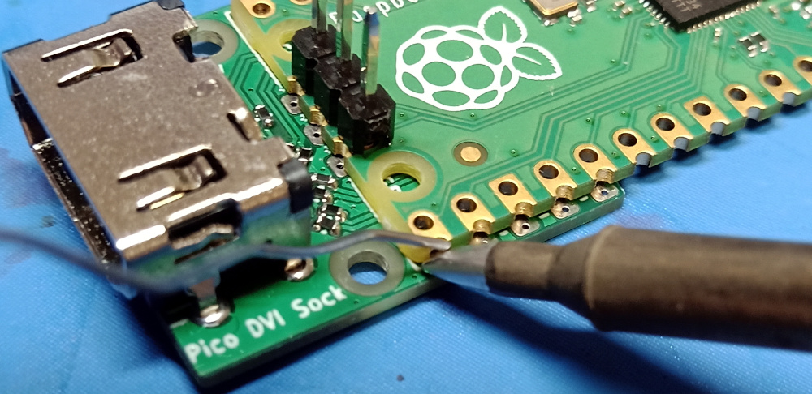
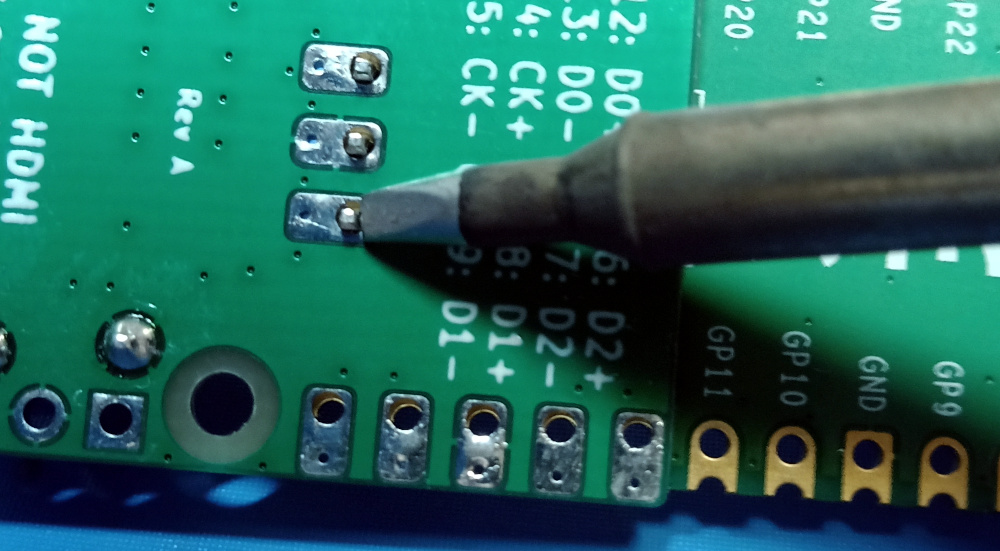
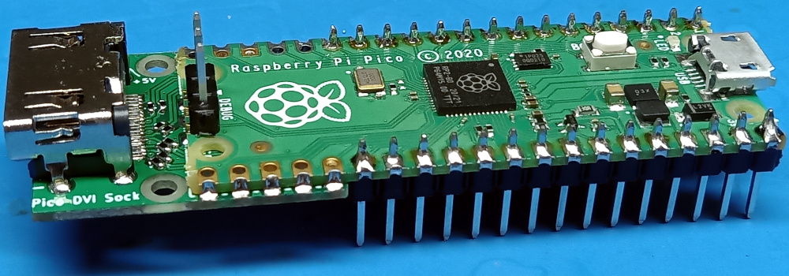
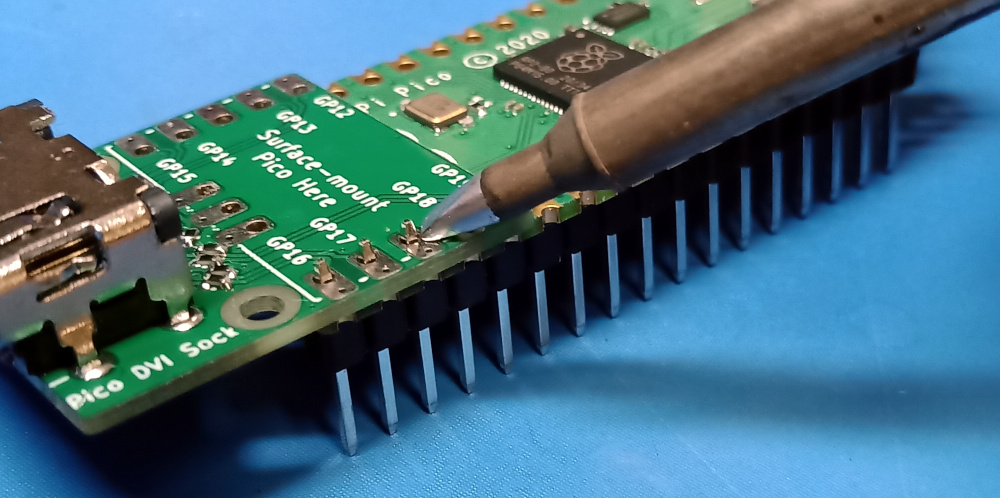
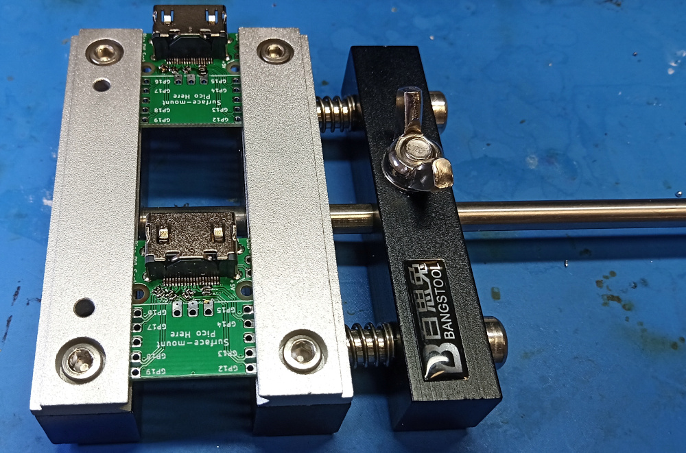

Pico DVI Sock
=============

You surface mount solder the Raspberry end of your Pico on top of this board (thanks to the castellations on Pico's header footprints). This gives you an HDMI-shaped socket at the opposite end to the micro USB socket, which you can drive DVI-D video through. The remaining Pico pins can still have headers inserted, so that the board can be inserted into a breadboard.

[See the schematic (PDF)](dvi-sock.pdf)

The PCB layout is compatible with JLCPCB 2-layer prototyping service. Select **1mm** board thickness when you check out (no extra cost).

> :warning: **This board was created with KiCad Nightly (5.99).** Exported gerbers are in `gerb/`, so you can order PCBs without installing this version of KiCad.

Bill of Materials
-----------------

- 1× Stewart SS-53000-001 connector [(DigiKey link)](https://www.digikey.co.uk/product-detail/en/stewart-connector/SS-53000-001/380-SS-53000-001-ND/10492172)
- 8× 0402 270 ohm resistors
- _(optional)_ 1× 2-pin 2.54 mm header to supply +5V to the Sink

Soldering Tips (Fitting Sock to Pico)
-------------------------------------

The Raspberry end of Pico should be surface-mount soldered on top of the Sock. The image below shows the correct orientation: the last 5 castellated holes on each long edge of Pico align with 5 pads on the Sock, to connect GP12-19 and GND on Pico to the TMDS pairs and signal ground. The text saying "Surface-mount Pico Here" on top of the Sock should be covered by the Pico.

Aligned in this way, there is surface-to-surface contact between each metal pad on the Sock, and the corresponding metal pad on Pico. To successfully solder the two boards, we need to flow solder into the narrow gap between the two pads, in a thin film that *wets* both surfaces to create a strong mechanical and electrical bond. The trick here is to get both pads hot simultaneously, melt solder onto one of the pads, and let surface tension do the work.

> :information_source: **To help get the two boards aligned**, you might find it helpful to push a 3-pin header through the debug contacts (without soldering it yet), as shown in the next image.

Things to note in the above image:

- The soldering iron is in contact with the flat upper surface of the surface mount pad on the Sock, and *simultaneously* touches the castellation surface on the side of Pico, so that both pads are brought up to soldering temperatures simultaneously.
- The solder is fed onto the castellated surface, and melted by the heat of the pad, **not** directly by the iron.
    - This is generally true in soldering: you heat the two surfaces you want to solder, and then melt solder onto those surfaces
    - This lets the flux in the solder work its magic, and clean the surfaces of oxidation as you solder, so that you get a strong joint
    - It also ensures the surface you are soldering is at a temperature where it can be *wetted* by the solder, i.e. surface tension will spread solder across the surface in a film, instead of sitting on top in a useless blob

> :warning: **I recommend just soldering the 5 pads along each edge,** and not the 3 debug pads at this point. It's too easy to get a solder blob on the surface-mount resistors when trying to solder the debug pads.

Pico and the Sock are both thinner than usual PCBs (1mm each) so the debug pin header can be pushed through both boards, and through-hole soldered from the back as normal:

- Bring the soldering iron in contact with the pad surface and the side of the header pin, so that both get hot simultaneously
- Introduce solder from the opposite side to the iron, so that surface tension sucks the solder into the hole and creates a strong joint
- You might want to keep the iron there for a little longer so that solder can flow down onto the Pico's through-hole pad, as well as the one on the Sock

Once the Sock is mounted, you can populate the remaining through-holes on Pico with 2.54 mm headers if you choose, so the board can be pushed into a breadboard.

Finally, an alternative if you want to avoid surface mount soldering: you can push headers into Pico from the bottom, sit the Sock onto the stubs of the headers that are sticking through, and then through-hole solder from the top, like shown here:

> :warning: **You should cut off the last 5 pins on each side** (GP12-GP19 and the two GNDs, which connect through the Sock), if you solder the boards this way and intend to plug this board into a breadboard, so that the high-speed serial video signals aren't connected to the breadboard parasitics.

Soldering Tips (Assembling a DVI Sock)
--------------------------------------

- Use flux
- Fine-pitch surface mount components can smell fear. Show them who's boss
- Get multiple spare sets of components and PCBs
- **Use lots of flux**
- These PCBs are pretty tiny so you want something to hold them. I recommend a Stickvise (or knock off), like shown here:

